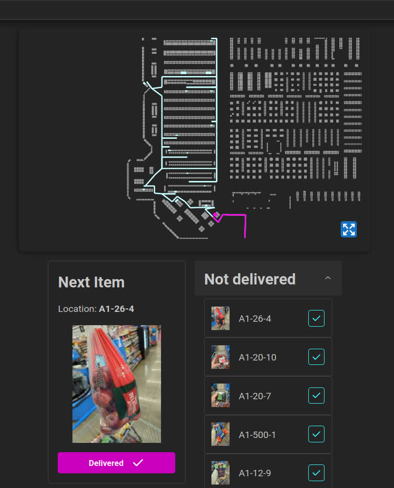

# Walmart Goback

[Live link](https://walmart-goback.sidharta.xyz/home)

## The problem this project solves

A common task as a walmart associate is to put the gobacks (items that were
misplaced) in their correct shelves. A common practice is to bring all gobacks
to a single spot at the store, load them into shopping carts, and assign
associates to work on the shopping carts untill they're all empty.

When working on these shopping carts, an associate might have items that are
located in wildly different places in the store. If the associate is not aware
of where each item is located, their trips will not be optimal, and they will
have to spend more time and energy than it should be required.

## The solution

This project allows the user to trace an optimal path for their goback cart.
They will first take a picture of each item and assign a location to them. The
program will then trace an optimal path for the whole cart, and display it to
the user.

## The Front-End

This is a simple [react](https://react.dev/) app built using
[vite](https://vitejs.dev/), [mantine](https://mantine.dev/) and
[openapi](https://www.openapis.org/).

## The Back-End

Repository can be found
[here](https://github.com/Jeansidharta/walmart-goback-backend)

## The Router

The code that actually finds the best route can be found
[here](https://github.com/Jeansidharta/walmart-goback-route). It's a rust
project compiled to WASM.

## The Map

The map is an SVG image edited with [Inkscape](https://inkscape.org/). The repo
can be found [here](https://github.com/Jeansidharta/walmart-goback-map)
